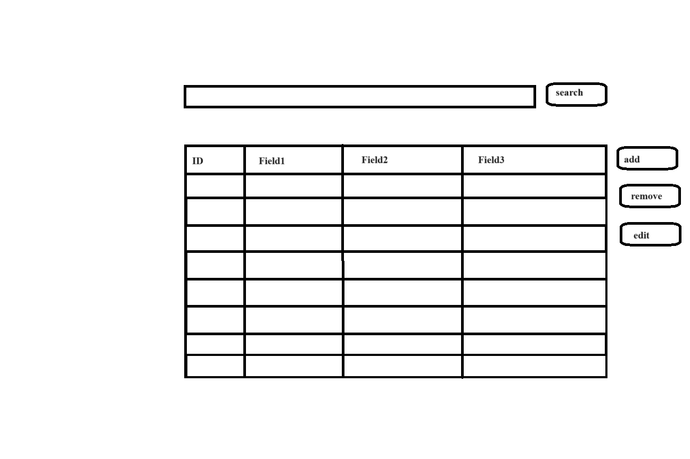
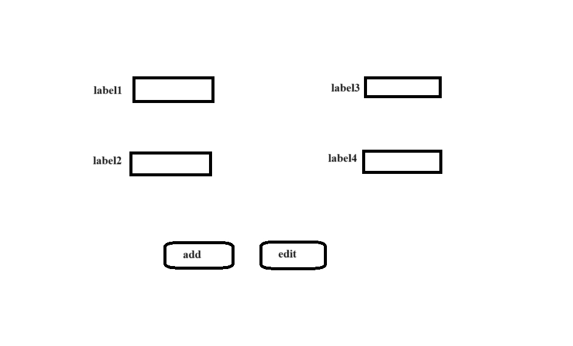

# Лабораторная работа 1

## 1. Название проекта

Система мониторинга и администрирования складов хранения оборудования для малого предприятия.

## 2. Краткое описание идеи проекта

Создать десктопное приложение, которе позволит сотрудникам некого предприятия, бронировать и получать оборудование, необходимое для работы, со склада. Оборудование после использования, возвращается на склад. Суть заключается в том, что бы избежать лишнего хождения сотрудников на склад, для проверки того, отсутствует необходимое оборудование или нет.

## 3. Краткое обоснование целесообразности и актуальности проекта

В 2021 году я был на беломорской биологической станции в качестве волонтера. Моей задачей было проводить ревизию складов с оборудованием. Все записи о том кто и когда берет оборудование велись в тетрадь на складе. То есть чтобы взять, допустим, микроскоп, необходимо было придти на склад в рабочее время, которе не установлено, убедиться что микроскоп есть, записаться в тетрадь, и взять его. Я хочу попробовать оптимизировать данный процесс.

## 4. Требования

Разрабатываемое приложение должно устойчиво работать на операционных системах типа Windows. 

## 5. Компонентная диаграмма системы

## 6. Use-Case - диаграмма

## 7. ER-диаграмма сущностей

## 8. Диаграмма БД

## 9. Пользовательские сценарии

Неавторизованный пользователь:
1) Зарегистрироваться: ввести логин и пароль.

Администратор склада:
1) Выйти из системы
2) Добавлять, удалять, изменять оборудование, инвентаризованное оборудование
3) Добавлять, удалять, изменять местоположение и расположение
4) Просматривать оборудование, инвентаризованное оборудование, занятое оборудование, расположение

Администратор по сотрудникам:
1) Выйти из системы
2)Добавление, изменение, удаление сотрудников
3) Просмотр сотрудников

Сотрудник:
1)  Выйти из системы
2) Просмотр оборудования
3) Резервирование оборудования (добавление в занятое оборудование)
4)Просмотр своего занятого оборудования

Кладовщик:
1) Выйти из системы
2)Просмотр занятого оборудования, местоположения, инвентарного оборудования, сотрудников
3) Удаление из занятого оборудование при возврате такого

## 10. Формализация бизнес-правил

## Эскизы

